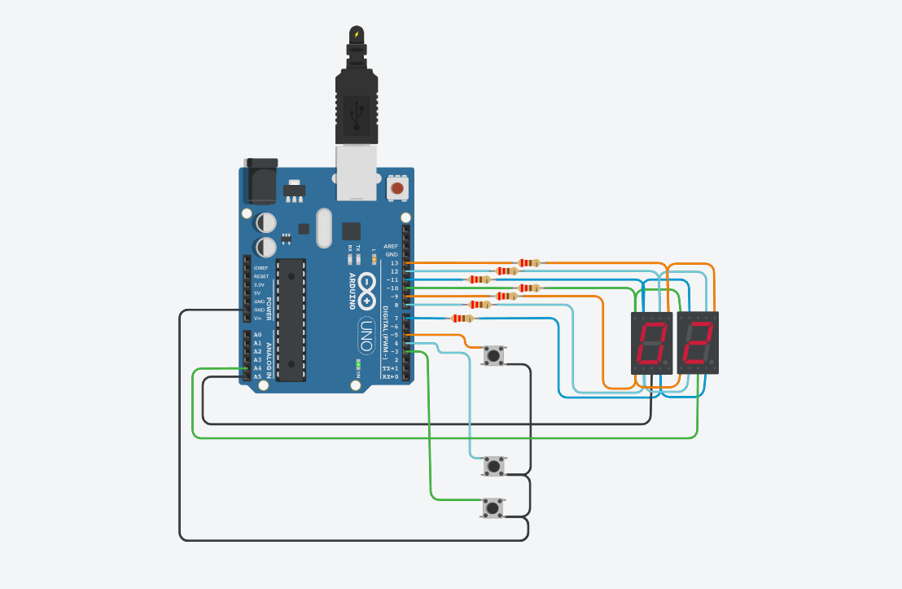
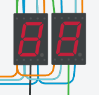
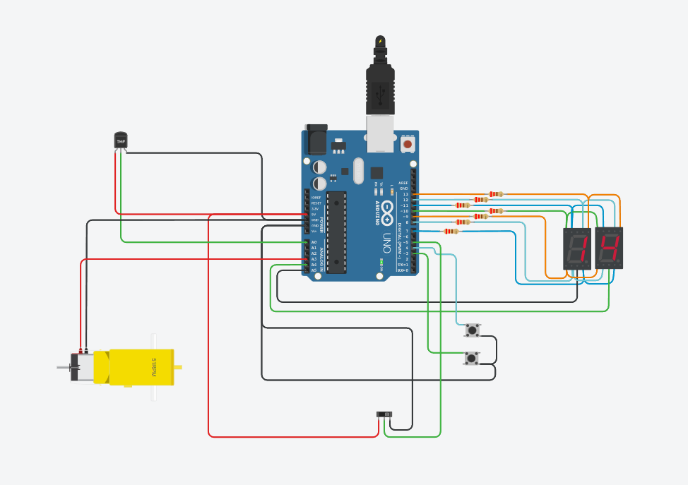
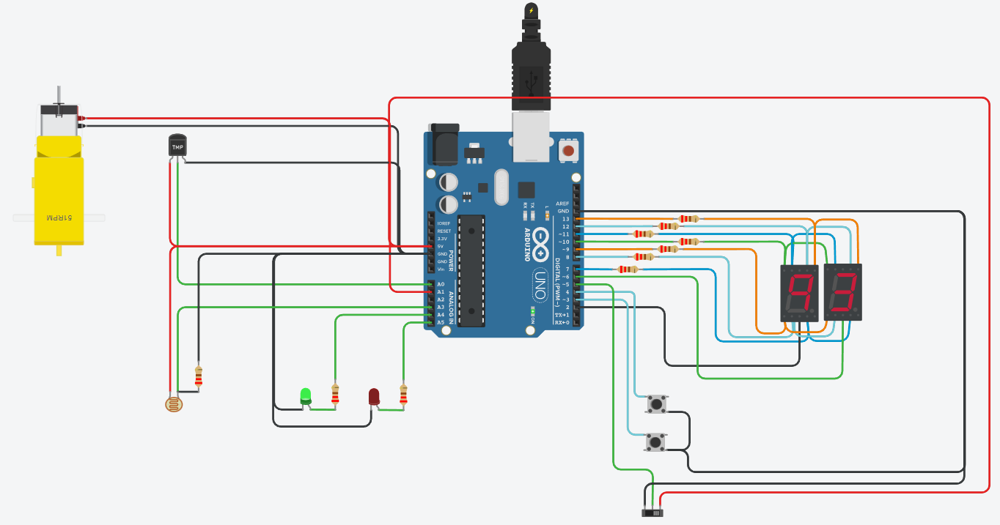

## DOCUMENTACION DEL TRABAJO PRACTICO DE SPD

- **Alumno**: Matias Emanuel Briceño Castillo

 - **Legajo**: 115466

### INTEGRANTES

- Almonacid, Emir Leandro

- Cabral, Ezequiel Matias

### Desarrollo del proyecto

El proyecto consta de 3 partes evolutivas donde se enmpieza mostrando un contador y finaliza con la integracion de un sensor de temperatura, un motor de aficionado, una foto resistencia, leds, un interruptor y se agrego la capacidad de contar y mostrar tambien los numeros primos que se encuentran entre 0 y 97.
El proceso de integracion sera explicado en las siguientes lineas 

* ### Parte 1

La primera PARTE inicia con 2 display de 7 segmentos que mostraran los numeros del 0 al 99 estando conectados en serie desde el pine 13 hasta el 7 inclusive, todos ellos configurados con la modalidad OUTPUT los cuales se encargaran de brindar la entrada de corriente.
Como salida de la corriente, los display, estan conectados a los pines analogicos A4 Y A5, tambien con la modalidad OUTPUT.

~~~ C++
  // como configurar un pin como OUTPUT dentro de la funcion setup.
  pinMode(13,OUTPUT);
~~~

El funcionamiento del display es el siguiente, cada display contiene 7 leds y estos se encienden  si la corriente circula a traves de ellos. Para que circule la corriente, el pin al que estan conectado cada led les tiene que entregar corriente y esta ultima debe circular a traves de ellos donde la salida es el pin A4 para el display que muestra la unidad y el pin A5 para el que muestra la decena.
Entonces para que circule la corriente la configuracion el pin que entrega corriente debe ser 1 y se escribe en el codigo de la siguiente manera:

~~~ C++
  //PASARLE COMO PARAMETRO HIGH O 1 ES LO MISMO
  digitalWrite(A4,1);
  //ASI TAMBIEN FUNCIONA
  digitalWrite(A4,HIGH);
~~~

Como el pin A4 O A5 tambien estan configurado para entregar corriente solamente la corriente podra fluir si el estado de ellos es 0 o LOW.

~~~ C++
  //PASARLE COMO PARAMETRO LOW O 0 ES LO MISMO
  digitalWrite(A4,0);
  //ASI TAMBIEN FUNCIONA
  digitalWrite(A4,LOW);
~~~

Adjuntamos ejemplo y su explicacion
Si todos los pines que entregan corrientes estan configurados como HIGH y los pines A4 Y A5 estan configurados como low, el codigo y lo que se vera en los display sera lo siguiente

~~~ C++

  // permitimos la entrega de corriente de todos los pines
  digitalWrite(A,HIGH);
  digitalWrite(B,HIGH);
  digitalWrite(C,HIGH);
  digitalWrite(D,HIGH);
  digitalWrite(E,HIGH);
  digitalWrite(F,HIGH);
  digitalWrite(G,HIGH);

  //impedimos la entrega de corriente de los pines A4 y A5

  digitalWrite(DISPLAYUNI,LOW);
  digitalWrite(DISPLAYDEC,LOW);

~~~
 

Por ultimo tambien contamos con 3 pulsadores, uno para reinicar el contador, otro para avanzar al siguiente numero y el ultime para retroceder un numero. En este caso la corriente solamente fluye cuando el pulsador es presionado.
Cada pulsador esta conectado a un pin que es capaz de entregar y recibir energia con la configuracion INPUT_PULLUP

~~~ C++

  // configuramos el pulsador que resetea el contador con un pin input_pullup dentro de la funcion setup.
  // RESET = pin 5;
  pinMode(RESET,INPUT_PULLUP);

~~~

Para saber si el pulsador esta siendo presionado debemos leer el estado del pin RESET. Si el estado es 1 o HIGH entonces la corriente no esta circulando pero si el estado es 0 o LOW resulta si lo hace.
La lectura de pin podemos hacerla con la siguiente funcion:

~~~ C++

  int estado_del_pin = digitalRead(RESET);

~~~

La dificultad de este proyecto se encontraba en como mostrar 2 numeros distintos en simultaneo porque si mostraba un numero este se visualizaba en ambos display, es decir, si mostrabas el numero 81 se visualizaba 88.
Esta complicacion se soluciono mostrando un numero pero en un solo display, es decir dejando fluir la corriente sobre uno y sobre el otro no. Luego cargar un delay minimo para que llegue a visualizarse correctamente y por ultimo apagando todos los leds. Despues de este procedimiento hacemos lo mismo pero invirtiendo los displays que prendimos o apagamos. Si en el caso anterior prendimos el display de las unidades en este sera el display que se apagara por lo tanto el que se mostrara sera el de la decena.
Adjunto el codigo del algoritmo:

~~~ C++

  void mostrar_numero(int numero)
{
  decena = numero / 10;
  unidad = numero % 10; 
 
  
  
  digitalWrite(DISPLAYDEC,LOW);
  digitalWrite(DISPLAYUNI,HIGH);
  prender_numero(decena);
  delay(10);
  apagar_todos();
  
  digitalWrite(DISPLAYDEC,HIGH);
  digitalWrite(DISPLAYUNI,LOW);
  prender_numero(unidad);
  delay(10);
  apagar_todos();
  	
}

~~~

Con toda esta logica explicada anteriormente se pudo realizar la parte 1

Tambien anexo la explicacion de la necesidad y la logica de la funcion keypressed(). Esta surge debido a que si se mantenia apretado el pulsador el contador avanzaba o retrocedia con mayor o menor velocidad dependiendo del delay que se utilizaba para mostrar el numero en los displays. Si el delay era mayor bajaba la visibilidad de los numeros en el display pero si el delay era menor sucedia lo contrario. Si bien la logica nos conduce a un delay bajo el problema era que al presionar el pulsador el contador aumentaba varios numeros.
Ante esta problematica se recurre a la funcion "keypressed" la cual guarda el estado previo del pulsador y lo compara con el actual. Si estos son distintos se realizara la accion correspondiente al pulsador, ya sea resetear, avanzar o retroceder.
Esta funcion fue extraida de lo videos subidos al classroom.

~~~ C++

int keypressed()
{
  sube = digitalRead(AUMENTAR);
  baja = digitalRead(DISMINUIR);
  reset = digitalRead(RESET);
  
  if(sube)
  {
	subePrevia=1;
  }
  if(baja)
  {
	bajaPrevia=1;
  }
  if(reset)
  {
	resetPrevia=1;
  }
  
  if(sube == 0 && sube!= subePrevia)
  {
    subePrevia = sube;
    return AUMENTAR;
  }
  if(baja == 0 && baja != bajaPrevia)
  {
    bajaPrevia = baja;
    return DISMINUIR;
  }
  if(reset == 0 && reset != resetPrevia)
  {
    resetPrevia = reset;
    return RESET;
  }
  
  return 0; 
~~~

Haga click **[aqui](https://www.tinkercad.com/things/kh0pY6c2NwD?sharecode=sBIrmK2LLrWdw0dRooUUQgn2emfkoky24-wjMsacfnU)** para ir al proyecto en tinkercard.

* ### Parte 2

En la seguda parte del proyecto eliminamos el boton de reset(encargado de reiniciar el contador), agregamos nuevos componentes y nuevos funcionalidades detalladas en las siguientes lineas:

#### Componentes
* Interruptor deslizante
* Sensor de temperatura
* Motor de aficionado

#### Funcionalidades

* El interruptor deslizante nos permite mostrar los numeros primos comprendidos entre 0 y 99 si esta deslizado a la izquierda o mostrar los numeros entre 0 y 99 si esta a la derecha. El interruptor esta conectado al pin de 5V, al pin GND y al pin 5 en modo INPUT. Si muestra los numeros primos la corriente fluye del pin de 5V al pin 5 por lo tanto la lectura que obtendremos del estado del pin 5 sera igual a 1.

~~~ C++

  int estado_del_pin = digitalRead(CONTADOR_PRIMOS);
  Serial.println(estado_del_pin) // -> imprimira por consola "1"
~~~

Con esta logica decidimos mostrar en la funcion loop que numero mostrar. Ademas por parecernos mas practico decidimos guardarnos en una lista los numeros primos existentes entre 0 y 99 para y mostrar el numero al que apunte nuestra variable indice. La variable indice va a ser la que avance o retroceda segun el pulsador que apretemos.

~~~ C++

int numeros_primos[] = {2, 3, 5, 7, 11, 13, 17, 19, 23, 29, 31, 37, 41, 43, 47, 53, 59, 61, 67, 71, 73, 79, 83, 89, 97};

void contador_primos()
{
  int pressed = keypressed();
  if(pressed == AUMENTAR)
  {
    indice++;
    indice = indice % 25;
    contador = numeros_primos[indice];        
  }
  if(pressed == DISMINUIR )
  {
    indice--;
    indice = indice < 0 ? 24 : indice % 25;
    contador = numeros_primos[indice];
  }  
}

~~~

Asi se vera la funcion loop con la nueva logica donde se define que contador se esta utilizando

~~~ C++

void loop()
{
  
  
  modo = digitalRead(CONTADOR_PRIMOS);
  
  
  if(modo == 0)
  {
    if(modo != modo_anterior)
    {
      contador = 0;
    }
    else
    {
      contador_normal();      
    }   
    
  }
  else
  {
    if(modo != modo_anterior)
    {
      indice = 0;
      contador = numeros_primos[indice];
    }
    else
    {      
      contador_primos();
    }

  }
    
  modo_anterior = modo;
  mostrar_numero(contador);
  funcionamiento_motor();
}

~~~

- El motor de aficionado funciona si la temperatura esta entre 0 y 30 grados celsius. Esta conectado al pin A3, definido como pin OUTPUT, el cual le modificamos el estado a HIGH cuando la temperatura se encuentra entre rango antes mencionado o si esta afuera del mismo su estado sera LOW cortando la circulacion de la corriente.
- El sensor de temperatura tiene 3 pines
  - Uno conectado a GND
  - Otro conectado a 5V
  - El ultimo conectado al pin analogico A0

El cambio de temperatura en el ambiente provoca la variacion de voltaje entregada por el sensor. Este cambio podemos leerlo a traves del pin analogico con la funcion "analogRead(A3)" que nos devolvera la tension entregada por el sensor en ese momento.
Como nosotros lo que deseamos saber es la temperatura actual para saber si encender o apagar el motor debemos utilizar la funcion map() para que nos traduzca el voltaje en grados celsius.
la variacion de tension como minimo que entrega el sensor es de 20 y como maximo es 358, siendo 20 = -40 grados celsius y 358 = 125 grados celsius. Estos son los datos que debemos brindarle a la funcion map para que nos calcule la proporcion en los valores intermedios.
Con esta logica definimos la siguiente funcion que tambien sera ejectuada en la funcion loop().

~~~ C++

void funcionamiento_motor()
{
  int temperaturaLeida = analogRead(SENTEMP);
  temperaturaReal = map(temperaturaLeida,20,358,-40,125);
  if(temperaturaReal > 0 && temperaturaReal < 31)
  {
    digitalWrite(MOTOR,HIGH); 
  }
  else
  {
    digitalWrite(MOTOR,LOW); 
  }
 
  
}
~~~

* ### Proyecto final

  

En esta ultima parte agregamos una fotoresistencia y 2 leds, uno rojo y el ultimo verde. Una fotoresistencia es un componente electrónico que cambia su resistencia eléctrica en función de la cantidad de luz que incide sobre ella. Cuanto más intensa es la luz que recibe, menor es su resistencia, y viceversa.
Esta variacion tambien la vamos a medir con el pin analogico A3 y la logica que utilizamos para que afecte el funcionoamiento de los componentes previos que ya tenemos sera la siguiente.
En el caso de que no haya la suficiente luz ambiental no funcionaran los displays y tampoco el motor de aficionado ademas se encendera el led Rojo como alerta de lo sucedido. En el caso contrario ademas de funcionar el resto de los componentes el led verde se encendera. 
En el siguiente bloque de codigo se vera la logica empleada tanto en la funcion loop() como en la funcion funcionamiento_fotores()  
~~~ C++

void loop()
{
  hay_energia = funcionamiento_fotores();
  if(hay_energia) // si hay la suficiente luz ambiental funcionaran el resto de los componentes
  {
    modo = digitalRead(CONTADORNORMAL); 
  
    if(modo != modo_anterior)
    {
      contador = 0;
      indice = 0;
      contador_primo = numeros_primos[indice];    
    }
    else
    {
      contador_programa();   
    }
    
    if(modo == 0)
    {
      mostrar_numero(contador_primo);
    }
    else
    {
      mostrar_numero(contador);
    }

    modo_anterior = modo;
    funcionamiento_motor();    
    
  }
  else // sin la luz necesaria no funcionara ni los displays ni el motor
  {
    digitalWrite(MOTOR,LOW);
    apagar_todos();
  }  
  
}

bool funcionamiento_fotores()
{
  valor = analogRead(FOTOR);
  hay_energia = true;
  if(valor >= 204)
  {
    digitalWrite(VERDE,HIGH);
    digitalWrite(ROJO,LOW);
  }
  else
  {
    apagar_todos();
    digitalWrite(VERDE,LOW);
    digitalWrite(ROJO,HIGH);
    hay_energia = false;
  }
  
  return hay_energia;
}

~~~

Tambien debo aclarar que se cambio el nombre de la funcion keypressed() por el de tecla_presionada() para su mejor comprension, se unfico en una unica funcion contador_programa() encargada de llevar la cuenta tanto del contador de numeros primos como los normales y en la funcion la loop se decidio cambiar la logica para el ahorro de lineas que se repetian.  

 

